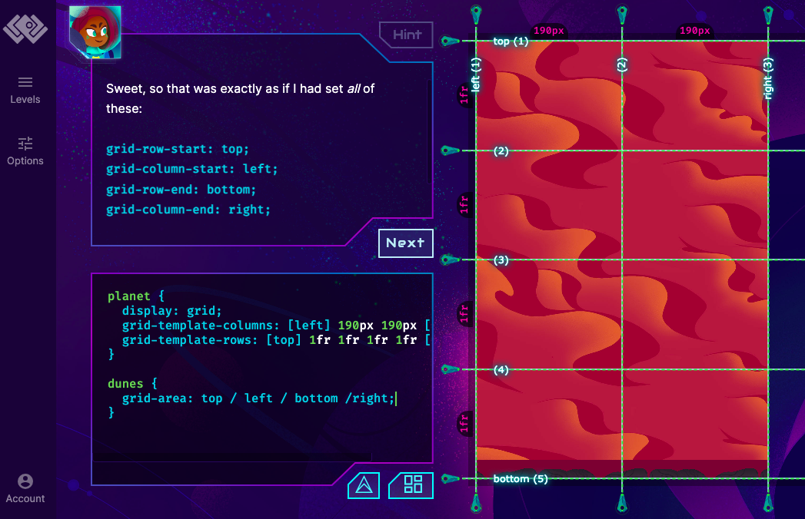

https://mastery.games/gridcritters/chapter/3/level/13


```css
planet {
  display: grid;
  grid-template-columns: 1fr repeat(5, [grass] 50px) [grass] 1fr;
  grid-template-rows: 1fr;
}

grass {
  grid-column: grass 2 / grass 5;
}
```

### Grid Area

```css
planet {
  display: grid;
  grid-template-columns: [left] 190px 190px [right];
  grid-template-rows: [top] 1fr 1fr 1fr 1fr [bottom];
}

dunes {
  grid-area: top / left / bottom / right;
}
```