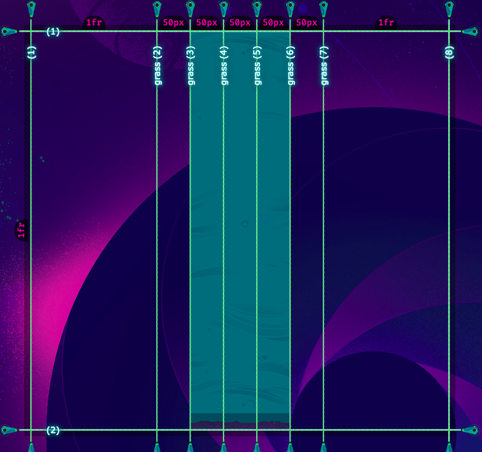

https://mastery.games/gridcritters/chapter/3/level/13


```css
planet {
  display: grid;
  grid-template-columns: 1fr repeat(5, [grass] 50px) [grass] 1fr;
  grid-template-rows: 1fr;
}

grass {
  grid-column: grass 2 / grass 5;
}
```

