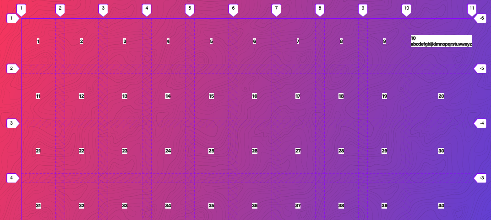
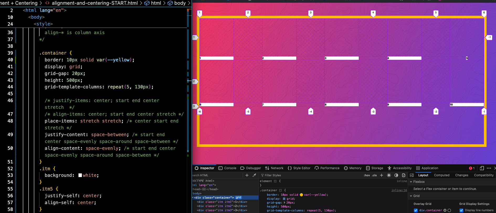
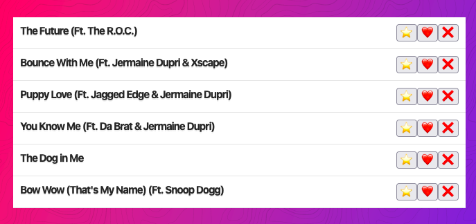
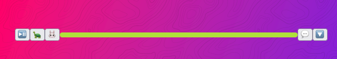

TL;DR
```css
.container {
	display: grid;
	gap: 20px;
	grid-template-columns: repeat(auto-fit, minmax(100px, 1fr));
	grid-template-rows: repeat(auto-fill, minmax(100px, 1fr));
	/* start end center stretch space-evenly space-around space-between */
	place-items: center center;
	place-content: center center; 
	justify-self: stretch;
	align-self: stretch;
	justify-content: stretch;
	align-content: stretch;
	justify-items: stretch;
	align-items: stretch;
	order: 1; /* order property is default 0 meaning first */
}
```


```css
/*
  Oh Hello!

  These are some base styles so that our tutorial looks good.

  Let's go through the important bits real quick
*/
:root {
  --yellow: #ffc600;
  --black: #272727;
}

html {
  /* border-box box model allows us to add padding and border to our elements without increasing their size */
  box-sizing: border-box;
  /* A system font stack so things load nice and quick! */
  font-family: -apple-system, BlinkMacSystemFont, "Segoe UI", Roboto, Helvetica,
    Arial, sans-serif, "Apple Color Emoji", "Segoe UI Emoji", "Segoe UI Symbol";
  font-weight: 900;
  font-size: 10px;
  color: var(--black);
  text-shadow: 0 2px 0 rgba(0, 0, 0, 0.07);
}

/*
  WAT IS THIS?!
  We inherit box-sizing: border-box; from our <html> selector
  Apparently this is a bit better than applying box-sizing: border-box; directly to the * selector
*/
*,
*:before,
*:after {
  box-sizing: inherit;
}

body {
  background-image: url("./images/topography.svg"),
    linear-gradient(110deg, #f93d66, #6d47d9);
  background-size: 340px, auto;
  min-height: calc(100vh - 100px);
  margin: 50px;
  /* background: white; */
  background-attachment: fixed;
  letter-spacing: -1px;
}

h1,
h2,
h3,
h4,
h5,
h6 {
  margin: 0 0 5px 0;
}
/* Each item in our grid will contain numbers */
.item {
  /* We center the contents of these items. You can also do this with flexbox too! */
  display: grid;
  justify-content: center;
  align-items: center;
  border: 5px solid rgba(0, 0, 0, 0.03);
  border-radius: 3px;
  font-size: 35px;
  background-color: var(--yellow); /* best colour */
}

.item p {
  margin: 0 0 5px 0;
}

```


- .container>.item{$}*10
```html
<div class="container">
      <div class="item">1</div>
      <div class="item">2</div>
      <div class="item">3</div>
      <div class="item">4</div>
      <div class="item">5</div>
      <div class="item">6</div>
      <div class="item">7</div>
      <div class="item">8</div>
      <div class="item">9</div>
      <div class="item">10</div>
    </div>

    <style>
      .container {
        display: grid;
        grid-template-columns: 200px 500px;
        grid-template-rows: 200px 100px 400px;
        gap: 20px;
      }
    </style>

```

- after the first 3 rows they size themselves via implicit grid

```html
 <body>
    <div class="container">
      <div class="item">1</div>
      <div class="item">2</div>
      <div class="item">3</div>
      <div class="item">4</div>
      <div class="item">5</div>
      <div class="item">6</div>
    </div>

    <style>
      .container {
        display: grid;
        gap: 20px;
        grid-template-columns: 200px 400px;
        grid-auto-rows: 50px;
      }
    </style>
```

```html
<div class="container">
      <div class="item">1</div>
      <div class="item">2</div>
      <div class="item">3</div>
      <div class="item">4</div>
      <div class="item">5</div>
      <div class="item">6</div>
    </div>

    <style>
      .container {
        display: grid;
        gap: 20px;
        grid-template-columns: 200px 400px;
        grid-auto-flow: column;
        grid-auto-columns: 100px;
        grid-auto-rows: 50px;
      }
    </style>
```

- auto keyword is the size of the content

```html
<div class="container">
      <div class="item">1</div>
      <div class="item">2</div>
      <div class="item">3</div>
      <div class="item">4</div>
      <div class="item">5</div>
      <div class="item">6</div>
      <div class="item">7</div>
      <div class="item">8</div>
      <div class="item">9</div>
      <div class="item">10</div>
      <div class="item">11</div>
      <div class="item">12</div>
      <div class="item">13</div>
      <div class="item">14</div>
      <div class="item">15</div>
    </div>

    <style>
      .container {
        border: 10px solid var(--yellow);
        display: grid;
        gap: 20px;
        grid-template-columns: auto 1fr;
      }
    </style>
  </body>
```


- repeat
```html
<style>
      .container {
        border: 10px solid var(--yellow);
        display: grid;
        gap: 20px;
        grid-template-columns: 100px repeat(2, auto 1fr);
      }
    </style>
```


- item spanning
```html
<div class="container">
      <div class="item item1">1</div>
      <div class="item item2">2</div>
      <div class="item item3">3</div>
      <div class="item item4">4</div>
      <div class="item item5">5</div>
      <div class="item item6">6</div>
      <div class="item item7">7</div>
      <div class="item item8">8</div>
      <div class="item item9">9</div>
      <div class="item item10">10</div>
      <div class="item item11">11</div>
      <div class="item item12">12</div>
      <div class="item item13">13</div>
      <div class="item item14">14</div>
      <div class="item item15">15</div>
      <div class="item item16">16</div>
      <div class="item item17">17</div>
      <div class="item item18">18</div>
      <div class="item item19">19</div>
      <div class="item item20">20</div>
      <div class="item item21">21</div>
      <div class="item item22">22</div>
      <div class="item item23">23</div>
      <div class="item item24">24</div>
      <div class="item item25">25</div>
      <div class="item item26">26</div>
      <div class="item item27">27</div>
      <div class="item item28">28</div>
      <div class="item item29">29</div>
      <div class="item item30">30</div>
    </div>

    <style>
      .container {
        border: 10px solid var(--yellow);
        display: grid;
        gap: 20px;
        grid-template-columns: repeat(5, 1fr);
      }
      .item9 {
        background: mistyrose;
        grid-column: span 2;
      }
    </style>
```


- more spanning
	- implicit columns
```html
<div class="container">
      <div class="item item1">1</div>
      <div class="item item2">2</div>
      <div class="item item3">3</div>
      <div class="item item4">4</div>
      <div class="item item5">5</div>
      <div class="item item6">6</div>
      <div class="item item7">7</div>
      <div class="item item8">8</div>
      <div class="item item9">9</div>
      <div class="item item10">10</div>
      <div class="item item11">11</div>
      <div class="item item12">12</div>
      <div class="item item13">13</div>
      <div class="item item14">14</div>
      <div class="item item15">15</div>
      <div class="item item16">16</div>
      <div class="item item17">17</div>
      <div class="item item18">18</div>
      <div class="item item19">19</div>
      <div class="item item20">20</div>
      <div class="item item21">21</div>
      <div class="item item22">22</div>
      <div class="item item23">23</div>
      <div class="item item24">24</div>
      <div class="item item25">25</div>
      <div class="item item26">26</div>
      <div class="item item27">27</div>
      <div class="item item28">28</div>
      <div class="item item29">29</div>
      <div class="item item30">30</div>
    </div>

    <style>
      .container {
        border: 10px solid var(--yellow);
        display: grid;
        gap: 20px;
        grid-template-columns: repeat(5, 1fr);
      }
      .item9 {
        background: mistyrose;
        grid-column: span 10;
        grid-row: span 2;
      }
    </style>
```


- grid-column is shorthand for grid-column-start and grid-column end; let's make it explicit in order to place the item in a specific location on the grid
```html
<div class="container">
      <div class="item item1">1</div>
      <div class="item item2">2</div>
      <div class="item item3">3</div>
      <div class="item item4">4</div>
      <div class="item item5">5</div>
      <div class="item item6">6</div>
      <div class="item item7">7</div>
      <div class="item item8">8</div>
      <div class="item item9">9</div>
      <div class="item item10">10</div>
      <div class="item item11">11</div>
      <div class="item item12">12</div>
      <div class="item item13">13</div>
      <div class="item item14">14</div>
      <div class="item item15">15</div>
      <div class="item item16">16</div>
      <div class="item item17">17</div>
      <div class="item item18">18</div>
      <div class="item item19">19</div>
      <div class="item item20">20</div>
      <div class="item item21">21</div>
      <div class="item item22">22</div>
      <div class="item item23">23</div>
      <div class="item item24">24</div>
      <div class="item item25">25</div>
      <div class="item item26">26</div>
      <div class="item item27">27</div>
      <div class="item item28">28</div>
      <div class="item item29">29</div>
      <div class="item item30">30</div>
    </div>

    <style>
      .container {
        border: 10px solid var(--yellow);
        display: grid;
        gap: 20px;
        grid-template-columns: repeat(5, 1fr);
      }
      .item9 {
        background: mistyrose;
        grid-column-start: 2;
        grid-column-end: 5;
      }
    </style>
```


- now we can use the shorthand
```html
<div class="container">
      <div class="item item1">1</div>
      <div class="item item2">2</div>
      <div class="item item3">3</div>
      <div class="item item4">4</div>
      <div class="item item5">5</div>
      <div class="item item6">6</div>
      <div class="item item7">7</div>
      <div class="item item8">8</div>
      <div class="item item9">9</div>
      <div class="item item10">10</div>
      <div class="item item11">11</div>
      <div class="item item12">12</div>
      <div class="item item13">13</div>
      <div class="item item14">14</div>
      <div class="item item15">15</div>
      <div class="item item16">16</div>
      <div class="item item17">17</div>
      <div class="item item18">18</div>
      <div class="item item19">19</div>
      <div class="item item20">20</div>
      <div class="item item21">21</div>
      <div class="item item22">22</div>
      <div class="item item23">23</div>
      <div class="item item24">24</div>
      <div class="item item25">25</div>
      <div class="item item26">26</div>
      <div class="item item27">27</div>
      <div class="item item28">28</div>
      <div class="item item29">29</div>
      <div class="item item30">30</div>
    </div>

    <style>
      .container {
        border: 10px solid var(--yellow);
        display: grid;
        gap: 20px;
        grid-template-columns: repeat(5, 1fr);
      }
      .item9 {
        background: mistyrose;
        grid-column: 2/6;
      }
    </style>
```


- span 2 end at 6 (gives you span 2 starting from the end)
```html
<style>
      .container {
        border: 10px solid var(--yellow);
        display: grid;
        gap: 20px;
        grid-template-columns: repeat(5, 1fr);
      }
      .item9 {
        background: mistyrose;
        grid-column: span 2/6;
      }
    </style>
```


- tell it where to start and how far to go
```css
.item9 {
background: mistyrose;
grid-column: 1 / span 2;
}
```


- full width
```css
.item9 {
        background: mistyrose;
        grid-column: 1 / -1;
      }
```


- offset from the end
```css
.item9 {
        background: mistyrose;
        grid-column: 1 / -2;
      }
```


- grid-row
	- puts it out of order 
```css
.item9 {
        background: mistyrose;
        grid-column: 1 / -2;
        grid-row: 4 / span 2;
      }
```


- take up the entire explicit grid with 1 / -1
```css
.container {
        border: 10px solid var(--yellow);
        display: grid;
        gap: 20px;
        grid-template-columns: repeat(5, 1fr);
        grid-template-rows: repeat(5, 1fr);
      }
      .item9 {
        background: mistyrose;
        grid-column: 1 / -1;
        grid-row: 1 / -1;
      }
```


- grid-column span 2 grid-row 1 negative 1
```css
.item9 {
        background: mistyrose;
        grid-column: span 2;
        grid-row: 1 / -1;
      }
      ```


- practice
```css
.container {
        display: grid;
        grid-gap: 20px;
        /* Make the grid 10 columns wide, every other taking up twice the free space */
        grid-template-columns: repeat(5, 1fr 2fr);
        /* Make the grid have 10 explicit rows, 50px high each */
        grid-template-rows: repeat(10, 50px);
      }

      /* With Item 1, start at col 3 and go until 5 */
      .item1 {
        grid-column: 3 / 5;
      }

      /* With Item 2, start at col 5 and go until the end */
      .item2 {
        grid-column: 5 / -1;
      }

      /* Make Item 5 double span 2 cols and rows */
      .item5 {
        grid-column: span 2;
        grid-row: span 2;
      }

      /* Make Item 8 two rows high */
      .item8 {
        grid-row: span 2;
      }

      /* Make Item 15 span the entire grid width */
      .item15 {
        grid-column: 1 / -1;
      }

      /* Make item 18 span 4 widths, but end at 9 */
      .item18 {
        grid-column: span 4 / 9;
      }

      /* Make item 20 start at row 4 and have a height of 3 rows */
      .item20 {
        grid-row: 4 / span 3;
      }
      ```


- auto-fit, auto-fill minmax
- auto-fill automatically fills columns to the right when the viewport width expands (even if there is no content, there are still new columns being created)
- auto-fit automatically fits the number of columns to the content
	- fit refers to column and viewport relationship rather than data to column (if the content is wider than your minmax, it will not magically make the column wider)
```css
.container {
        display: grid;
        grid-gap: 20px;
        border: 10px solid var(--yellow);
        grid-template-columns: repeat(auto-fit, minmax(100px, 1fr));
        grid-template-columns: repeat(auto-fill, minmax(100px, 1fr));
        
      }
      ```

- fit-content will clamp your content
```css
.container {
        display: grid;
        grid-gap: 20px;
        border: 10px solid var(--yellow);
        /* grid-template-columns: repeat(auto-fit, minmax(200px, 1fr)); */
        grid-template-columns: fit-content(100px) fit-content(100px);
      }
```


- grid-template-areas and grid-area
```html
<div class="container">
      <div class="item item1">
        <p>I'm Sidebar #1</p>
      </div>
      <div class="item item2">
        <p>
          Lorem ipsum dolor sit amet consectetur adipisicing elit. Inventore,
          sed.
        </p>
        <p>Lorem ipsum d</p>
      </div>
      <div class="item item3">
        <p>I'm Sidebar #2</p>
      </div>
      <div class="item footer">
        <p>I'm the footer</p>
      </div>
    </div>

    <style>
      .container {
        display: grid;
        grid-gap: 20px;
        border: 10px solid var(--yellow);
        grid-template-columns: 1fr;
        grid-template-rows: auto;
        grid-template-areas:
          "sidebar-1"
          "content"
          "sidebar-2"
          "footer";
      }
      .footer {
        grid-area: footer;
      }
      .item1 {
        grid-area: sidebar-1;
      }
      .item2 {
        grid-area: content;
      }
      .item3 {
        grid-area: sidebar-2;
      }

      @media (min-width: 900px) {
        .container {
          grid-template-columns: 1fr 500px 1fr;
          grid-template-rows: 150px 150px 100px;
          grid-template-areas:
            "sidebar-1 content sidebar-2"
            "sidebar-1 content sidebar-2"
            "footer footer footer";
        }
      }
    </style>
```

- line names allow you to specify the start and end point along a range of continuous values (named lines)
```html
<div class="container">
      <div class="item item1">1</div>
      <div class="item item2">2</div>
      <div class="item item3">3</div>
      <div class="item item4">4</div>
      <div class="item item5">5</div>
      <div class="item item6">6</div>
      <div class="item item7">7</div>
      <div class="item item8">8</div>
      <div class="item item9">9</div>
      <div class="item item10">10</div>
      <div class="item item11">11</div>
      <div class="item item12">12</div>
      <div class="item item13">13</div>
      <div class="item item14">14</div>
      <div class="item item15">15</div>
      <div class="item item16">16</div>
      <div class="item item17">17</div>
      <div class="item item18">18</div>
      <div class="item item19">19</div>
      <div class="item item20">20</div>
      <div class="item item21">21</div>
      <div class="item item22">22</div>
      <div class="item item23">23</div>
      <div class="item item24">24</div>
      <div class="item item25">25</div>
      <div class="item item26">26</div>
      <div class="item item27">27</div>
      <div class="item item28">28</div>
      <div class="item item29">29</div>
      <div class="item item30">30</div>
    </div>

    <style>
      .container {
        display: grid;
        grid-gap: 20px;
        grid-template-areas:
          "👀 👀 👀 👀 🍔 🍔 🍔 🍔"
          "👀 👀 👀 👀 🍔 🍔 🍔 🍔"
          "👀 👀 👀 👀 🍔 🍔 🍔 🍔"
          "👀 👀 👀 👀 🍔 🍔 🍔 🍔";
      }

      .item2 {
        /* grid-column: 2 / 5; */
        grid-column: 👀-start / 👀-end;
      }

      .item3 {
        grid-column: 👀-start / 🍔-end;
        grid-row-end: 👀-end;
      }
```


```css
.container {
        display: grid;
        grid-gap: 20px;
        grid-template-columns: 1fr 500px 1fr;
        grid-template-rows: repeat(10, auto);
      }
      .item3 {
        background: slateblue;
        grid-column: 2;
        grid-row: 1 / span 10;
      }
```


- CSS Grid Template Areas with Named Lines
```css
 .container {
      display: grid;
      grid-gap: 20px;
      grid-template-columns: [sidebar-start site-left] 1fr [sidebar-end content-start] 500px [content-end] 1fr [site-right];
      grid-template-rows: [content-top] repeat(10, auto) [content-bottom];
    }

    .item3 {
      background: slateblue;
      grid-column: content-start;
      grid-row: content-top / content-bottom;
      /* grid-row: 1 / span 10; */
    }
```


- grid autoflow dense
```css
.container {
        display: grid;
        grid-gap: 20px;
        grid-template-columns: repeat(10, 1fr);
      }
      .item:nth-child(6n) {
        background: cornflowerblue;
        grid-column: span 6;
      }
```


### Grid Alignment and Centering
```css
/*
        justify-items:
        align-items:

        justify-content:
        align-content:

        align-self:
        justify-self:

        justify-* is row axis
        align-* is column axis
      */

      .container {
        display: grid;
        grid-gap: 20px;
        grid-template-columns: repeat(10, 1fr);
        justify-items: center; 
      }
      .itm {
        background: white;
      }```


```css
.container {
        display: grid;
        grid-gap: 20px;
        grid-template-columns: repeat(10, 1fr);
        grid-template-rows: repeat(5, 100px);
        justify-items: center; /* start end center stretch  */
        align-items: center; /* start end center stretch  */
      }
```


- place items is a shorthand for justify and align similar to grid-row and grid-column
```css

      .container {
        display: grid;
        grid-gap: 20px;
        grid-template-columns: repeat(10, 1fr);
        grid-template-rows: repeat(5, 100px);
        /* justify-items: center; start end center stretch  */
        /* align-items: center; start end center stretch */
        place-items: center center;
      }
```

- justify-* and align-* is for hardcoded values where you want to tell the grid how to layout remaining space (not using fractional units where it flows automatically)
- place-items (and align/justify-items) is about placing the items (the actual content in the content box), whereas justify and align content is about the actual box per se

```css
/*
        justify-items:
        align-items:

        justify-content:
        align-content:

        align-self:
        justify-self:

        justify-* is row axis
        align-* is column axis
      */

      .container {
        border: 10px solid var(--yellow);
        display: grid;
        grid-gap: 20px;
        height: 500px;
        grid-template-columns: repeat(5, 130px);

        /* justify-items: center; start end center stretch  */
        /* align-items: center; start end center stretch */
        place-items: stretch stretch; /* center start end stretch */
        justify-content: space-between; /* start end center stretch space-evenly space-around space-between */
        align-content: space-evenly; /* start end center space-evenly space-around space-between */
      }
      .itm {
        background: white;
      }
      .itm5 {
        justify-self: center;
        align-self: center;
      }
```



```html
<!DOCTYPE html>
<html lang="en">
  <head>
    <meta charset="UTF-8" />
    <meta name="viewport" content="width=device-width, initial-scale=1.0" />
    <meta http-equiv="X-UA-Compatible" content="ie=edge" />
    <title>CSS Grid Image Gallery!</title>
  </head>

  <body>
    <div class="overlay">
      <div class="overlay-inner">
        <button class="close">× Close</button>
        
      </div>
    </div>

    <section class="gallery"></section>

    <style>
      * {
        box-sizing: border-box;
      }

      body {
        padding: 50px;
        font-family: sans-serif;
        background: linear-gradient(to right, #f93d66, #6d47d9);
      }

      h1,
      h2,
      h3,
      h4,
      h5,
      h6 {
        margin: 0 0 5px 0;
      }

      p {
        margin: 0 0 20px 0;
      }

      .close {
        background: none;
        color: black;
        border: 0;
      }

      .gallery {
        display: grid;
        grid-template-columns: repeat(auto-fill, 100px);
        grid-auto-rows: 100px;
        grid-auto-flow: dense;
      }

      .item {
        overflow: hidden;
        display: grid;
        grid-template-columns: 1fr;
        grid-template-rows: 1fr;
      }

      .item img {
        width: 100%;
        height: 100%;
        grid-row: 1/ -1;
        grid-column: 1/-1;
        object-fit: cover;
      }

      .item__overlay {
        background: #ffc60032;
        grid-column: 1 / -1;
        grid-row: 1/ -1;
        display: grid;
        place-items: center center;
        transition: 0.2s;
        transform: translateY(100%);
      }

      .item__overlay button {
        background: none;
        border: 2px solid white;
        color: white;
        text-transform: uppercase;
        background: rgba(0, 0, 0, 0.7);
        padding: 5px;
      }

      .item:hover .item__overlay {
        transform: translateY(0);
      }

      .item.h2 {
        grid-column: span 2;
      }
      .item.h3 {
        grid-column: span 3;
      }
      .item.h4 {
        grid-column: span 4;
      }
      .item.v2 {
        grid-row: span 2;
      }
      .item.v3 {
        grid-row: span 3;
      }
      .item.v4 {
        grid-row: span 4;
      }

      .overlay {
        position: fixed;
        background: rgba(0, 0, 0, 0.7);
        top: 0;
        right: 0;
        bottom: 0;
        left: 0;
        display: none;
        z-index: 2;
      }

      .overlay.open {
        display: grid;
        place-items: center center;
      }

      .overlay-inner {
        background: white;
        width: 70vw;
        padding: 20px;
      }

      .overlay img {
        width: 100%;
      }
    </style>

    <script>
      const gallery = document.querySelector(".gallery");
      const overlay = document.querySelector(".overlay");
      const overlayImage = overlay.querySelector("img");
      const overlayButton = overlay.querySelector("button.close");

      function generateHTML([h, v]) {
        return `
    <div class="item h${h} v${v}">
      
      <div class="item__overlay">
        <button>View →</button>
      </div>
    </div>
  `;
      }

      const randomNumber = (limit) => {
        return Math.floor(Math.random() * limit) + 1;
      };

      const clickHandler = (e) => {
        const src = e.currentTarget.querySelector("img").src;
        console.log(e.currentTarget);
        overlayImage.src = src;
        overlay.classList.add("open");
      };
      const closeHandler = () => {
        overlay.classList.remove("open");
      };

      const digits = Array.from({ length: 50 }, () => [
        randomNumber(4),
        randomNumber(4),
      ]).concat([
        [1, 1],
        [1, 1],
        [1, 1],
        [1, 1],
        [1, 1],
        [1, 1],
        [1, 1],
        [1, 1],
        [1, 1],
        [1, 1],
        [1, 1],
        [1, 1],
        [1, 1],
        [1, 1],
        [1, 1],
        [1, 1],
        [1, 1],
        [1, 1],
        [1, 1],
        [1, 1],
        [1, 1],
        [1, 1],
        [1, 1],
        [1, 1],
        [1, 1],
        [1, 1],
        [1, 1],
        [1, 1],
        [1, 1],
        [1, 1],
        [1, 1],
        [1, 1],
        [1, 1],
        [1, 1],
      ]);

      const html = digits.map(generateHTML).join("");
      gallery.innerHTML = html;

      const items = document.querySelectorAll(".item");
      items.forEach((item) => item.addEventListener("click", clickHandler));
      overlayButton.addEventListener("click", closeHandler);
    </script>
  </body>
</html>
```



```html
<!DOCTYPE html>
<html lang="en">

<head>
  <meta charset="UTF-8">
  <meta name="viewport" content="width=device-width, initial-scale=1.0">
  <link rel="stylesheet" href="../assets/style.css">
  <title>Flexbox vs CSS Grid: Controls on Right!</title>
</head>

<body>

  <!-- The everything on the right except the one thing -->

  <div class="tracks">
    <div class="track">
      <h2>The Future (Ft. The R.O.C.)</h2>
      <button>⭐</button>
      <button>❤️</button>
      <button>❌</button>
    </div>
    <div class="track">
      <h2>Bounce With Me (Ft. Jermaine Dupri & Xscape)</h2>
      <button>⭐</button>
      <button>❤️</button>
      <button>❌</button>
    </div>
    <div class="track">
      <h2>Puppy Love (Ft. Jagged Edge & Jermaine Dupri)</h2>
      <button>⭐</button>
      <button>❤️</button>
      <button>❌</button>
    </div>
    <div class="track">
      <h2>You Know Me (Ft. Da Brat & Jermaine Dupri)</h2>
      <button>⭐</button>
      <button>❤️</button>
      <button>❌</button>
    </div>
    <div class="track">
      <h2>The Dog in Me</h2>
      <button>⭐</button>
      <button>❤️</button>
      <button>❌</button>
    </div>
    <div class="track">
      <h2>Bow Wow (That's My Name) (Ft. Snoop Dogg)</h2>
      <button>⭐</button>
      <button>❤️</button>
      <button>❌</button>
    </div>
  </div>
  <style>
    .track {
      background: white;
      padding: 10px;
      display: grid;
      grid-template-columns: 1fr;
      grid-auto-flow: column;
      border-bottom: 1px solid rgba(0, 0, 0, 0.1);
    }
  </style>
</body>

</html>
```



- auto in gtc (grid-template-columns) is like fit to contents

```html
<!DOCTYPE html>
<html lang="en">
  <head>
    <meta charset="UTF-8" />
    <meta name="viewport" content="width=device-width, initial-scale=1.0" />
    <link rel="stylesheet" href="../assets/style.css" />
    <title>Flexbox vs CSS Grid: Flex on Item!</title>
  </head>

  <body>
    <!-- The Longer Item in the middle -->
    <div class="controls">
      <button>⏯️</button>
      <button>🐢</button>
      <button>🐰</button>
      <div class="scrubber"></div>
      <button>💬</button>
      <button>🔽</button>
    </div>

    <style>
      .controls {
        margin: 200px 0;
        display: grid;
        grid-template-columns: auto auto auto 1fr auto auto;
        place-items: center stretch;
      }

      .scrubber {
        background: #bada55;
        height: 10px;
        min-width: 100px;
        border-radius: 10px;
      }
    </style>
  </body>
</html>


```


BUT the above can be replaced with display: flex; and on the item to stretch: flex: 1; this saves us from having to specify the width of each item and only specify making 1 stretchy;

```css
 .controls {
        margin: 200px 0;
        /* display: grid;
        grid-template-columns: auto auto auto 1fr auto auto; */
        display: flex;
        place-items: center stretch;
      }

      .scrubber {
        background: #bada55;
        height: 10px;
        min-width: 100px;
        border-radius: 10px;
        flex: 1;
      }
```


### Recipes
- set 1 column and let all subsequent items flow (if you have multiple buttons or other items you don't want to count and keep track of)
	- we used this with the 'controls on the right' example
```css
.pen {
  display: grid;
  grid-template-columns: 1fr;
  grid-auto-flow: column;
  align-items: center;
  grid-gap: 10px;
}
```


