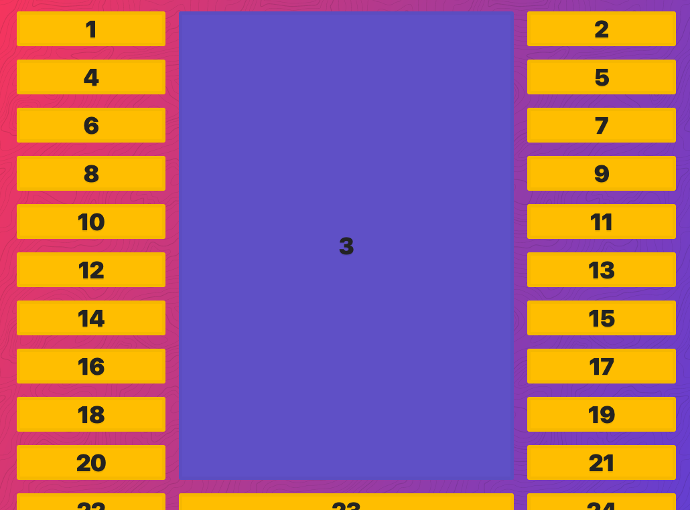

- .container>.item{$}*10
```html
<div class="container">
      <div class="item">1</div>
      <div class="item">2</div>
      <div class="item">3</div>
      <div class="item">4</div>
      <div class="item">5</div>
      <div class="item">6</div>
      <div class="item">7</div>
      <div class="item">8</div>
      <div class="item">9</div>
      <div class="item">10</div>
    </div>

    <style>
      .container {
        display: grid;
        grid-template-columns: 200px 500px;
        grid-template-rows: 200px 100px 400px;
        gap: 20px;
      }
    </style>

```

- after the first 3 rows they size themselves via implicit grid

```html
 <body>
    <div class="container">
      <div class="item">1</div>
      <div class="item">2</div>
      <div class="item">3</div>
      <div class="item">4</div>
      <div class="item">5</div>
      <div class="item">6</div>
    </div>

    <style>
      .container {
        display: grid;
        gap: 20px;
        grid-template-columns: 200px 400px;
        grid-auto-rows: 50px;
      }
    </style>
```

```html
<div class="container">
      <div class="item">1</div>
      <div class="item">2</div>
      <div class="item">3</div>
      <div class="item">4</div>
      <div class="item">5</div>
      <div class="item">6</div>
    </div>

    <style>
      .container {
        display: grid;
        gap: 20px;
        grid-template-columns: 200px 400px;
        grid-auto-flow: column;
        grid-auto-columns: 100px;
        grid-auto-rows: 50px;
      }
    </style>
```

- auto keyword is the size of the content

```html
<div class="container">
      <div class="item">1</div>
      <div class="item">2</div>
      <div class="item">3</div>
      <div class="item">4</div>
      <div class="item">5</div>
      <div class="item">6</div>
      <div class="item">7</div>
      <div class="item">8</div>
      <div class="item">9</div>
      <div class="item">10</div>
      <div class="item">11</div>
      <div class="item">12</div>
      <div class="item">13</div>
      <div class="item">14</div>
      <div class="item">15</div>
    </div>

    <style>
      .container {
        border: 10px solid var(--yellow);
        display: grid;
        gap: 20px;
        grid-template-columns: auto 1fr;
      }
    </style>
  </body>
```


- repeat
```html
<style>
      .container {
        border: 10px solid var(--yellow);
        display: grid;
        gap: 20px;
        grid-template-columns: 100px repeat(2, auto 1fr);
      }
    </style>
```


- item spanning
```html
<div class="container">
      <div class="item item1">1</div>
      <div class="item item2">2</div>
      <div class="item item3">3</div>
      <div class="item item4">4</div>
      <div class="item item5">5</div>
      <div class="item item6">6</div>
      <div class="item item7">7</div>
      <div class="item item8">8</div>
      <div class="item item9">9</div>
      <div class="item item10">10</div>
      <div class="item item11">11</div>
      <div class="item item12">12</div>
      <div class="item item13">13</div>
      <div class="item item14">14</div>
      <div class="item item15">15</div>
      <div class="item item16">16</div>
      <div class="item item17">17</div>
      <div class="item item18">18</div>
      <div class="item item19">19</div>
      <div class="item item20">20</div>
      <div class="item item21">21</div>
      <div class="item item22">22</div>
      <div class="item item23">23</div>
      <div class="item item24">24</div>
      <div class="item item25">25</div>
      <div class="item item26">26</div>
      <div class="item item27">27</div>
      <div class="item item28">28</div>
      <div class="item item29">29</div>
      <div class="item item30">30</div>
    </div>

    <style>
      .container {
        border: 10px solid var(--yellow);
        display: grid;
        gap: 20px;
        grid-template-columns: repeat(5, 1fr);
      }
      .item9 {
        background: mistyrose;
        grid-column: span 2;
      }
    </style>
```


- more spanning
	- implicit columns
```html
<div class="container">
      <div class="item item1">1</div>
      <div class="item item2">2</div>
      <div class="item item3">3</div>
      <div class="item item4">4</div>
      <div class="item item5">5</div>
      <div class="item item6">6</div>
      <div class="item item7">7</div>
      <div class="item item8">8</div>
      <div class="item item9">9</div>
      <div class="item item10">10</div>
      <div class="item item11">11</div>
      <div class="item item12">12</div>
      <div class="item item13">13</div>
      <div class="item item14">14</div>
      <div class="item item15">15</div>
      <div class="item item16">16</div>
      <div class="item item17">17</div>
      <div class="item item18">18</div>
      <div class="item item19">19</div>
      <div class="item item20">20</div>
      <div class="item item21">21</div>
      <div class="item item22">22</div>
      <div class="item item23">23</div>
      <div class="item item24">24</div>
      <div class="item item25">25</div>
      <div class="item item26">26</div>
      <div class="item item27">27</div>
      <div class="item item28">28</div>
      <div class="item item29">29</div>
      <div class="item item30">30</div>
    </div>

    <style>
      .container {
        border: 10px solid var(--yellow);
        display: grid;
        gap: 20px;
        grid-template-columns: repeat(5, 1fr);
      }
      .item9 {
        background: mistyrose;
        grid-column: span 10;
        grid-row: span 2;
      }
    </style>
```


- grid-column is shorthand for grid-column-start and grid-column end; let's make it explicit in order to place the item in a specific location on the grid
```html
<div class="container">
      <div class="item item1">1</div>
      <div class="item item2">2</div>
      <div class="item item3">3</div>
      <div class="item item4">4</div>
      <div class="item item5">5</div>
      <div class="item item6">6</div>
      <div class="item item7">7</div>
      <div class="item item8">8</div>
      <div class="item item9">9</div>
      <div class="item item10">10</div>
      <div class="item item11">11</div>
      <div class="item item12">12</div>
      <div class="item item13">13</div>
      <div class="item item14">14</div>
      <div class="item item15">15</div>
      <div class="item item16">16</div>
      <div class="item item17">17</div>
      <div class="item item18">18</div>
      <div class="item item19">19</div>
      <div class="item item20">20</div>
      <div class="item item21">21</div>
      <div class="item item22">22</div>
      <div class="item item23">23</div>
      <div class="item item24">24</div>
      <div class="item item25">25</div>
      <div class="item item26">26</div>
      <div class="item item27">27</div>
      <div class="item item28">28</div>
      <div class="item item29">29</div>
      <div class="item item30">30</div>
    </div>

    <style>
      .container {
        border: 10px solid var(--yellow);
        display: grid;
        gap: 20px;
        grid-template-columns: repeat(5, 1fr);
      }
      .item9 {
        background: mistyrose;
        grid-column-start: 2;
        grid-column-end: 5;
      }
    </style>
```


- now we can use the shorthand
```html
<div class="container">
      <div class="item item1">1</div>
      <div class="item item2">2</div>
      <div class="item item3">3</div>
      <div class="item item4">4</div>
      <div class="item item5">5</div>
      <div class="item item6">6</div>
      <div class="item item7">7</div>
      <div class="item item8">8</div>
      <div class="item item9">9</div>
      <div class="item item10">10</div>
      <div class="item item11">11</div>
      <div class="item item12">12</div>
      <div class="item item13">13</div>
      <div class="item item14">14</div>
      <div class="item item15">15</div>
      <div class="item item16">16</div>
      <div class="item item17">17</div>
      <div class="item item18">18</div>
      <div class="item item19">19</div>
      <div class="item item20">20</div>
      <div class="item item21">21</div>
      <div class="item item22">22</div>
      <div class="item item23">23</div>
      <div class="item item24">24</div>
      <div class="item item25">25</div>
      <div class="item item26">26</div>
      <div class="item item27">27</div>
      <div class="item item28">28</div>
      <div class="item item29">29</div>
      <div class="item item30">30</div>
    </div>

    <style>
      .container {
        border: 10px solid var(--yellow);
        display: grid;
        gap: 20px;
        grid-template-columns: repeat(5, 1fr);
      }
      .item9 {
        background: mistyrose;
        grid-column: 2/6;
      }
    </style>
```


- span 2 end at 6 (gives you span 2 starting from the end)
```html
<style>
      .container {
        border: 10px solid var(--yellow);
        display: grid;
        gap: 20px;
        grid-template-columns: repeat(5, 1fr);
      }
      .item9 {
        background: mistyrose;
        grid-column: span 2/6;
      }
    </style>
```


- tell it where to start and how far to go
```css
.item9 {
background: mistyrose;
grid-column: 1 / span 2;
}
```


- full width
```css
.item9 {
        background: mistyrose;
        grid-column: 1 / -1;
      }
```


- offset from the end
```css
.item9 {
        background: mistyrose;
        grid-column: 1 / -2;
      }
```


- grid-row
	- puts it out of order 
```css
.item9 {
        background: mistyrose;
        grid-column: 1 / -2;
        grid-row: 4 / span 2;
      }
```


- take up the entire explicit grid with 1 / -1
```css
.container {
        border: 10px solid var(--yellow);
        display: grid;
        gap: 20px;
        grid-template-columns: repeat(5, 1fr);
        grid-template-rows: repeat(5, 1fr);
      }
      .item9 {
        background: mistyrose;
        grid-column: 1 / -1;
        grid-row: 1 / -1;
      }
```


- grid-column span 2 grid-row 1 negative 1
```css
.item9 {
        background: mistyrose;
        grid-column: span 2;
        grid-row: 1 / -1;
      }
      ```


- practice
```css
.container {
        display: grid;
        grid-gap: 20px;
        /* Make the grid 10 columns wide, every other taking up twice the free space */
        grid-template-columns: repeat(5, 1fr 2fr);
        /* Make the grid have 10 explicit rows, 50px high each */
        grid-template-rows: repeat(10, 50px);
      }

      /* With Item 1, start at col 3 and go until 5 */
      .item1 {
        grid-column: 3 / 5;
      }

      /* With Item 2, start at col 5 and go until the end */
      .item2 {
        grid-column: 5 / -1;
      }

      /* Make Item 5 double span 2 cols and rows */
      .item5 {
        grid-column: span 2;
        grid-row: span 2;
      }

      /* Make Item 8 two rows high */
      .item8 {
        grid-row: span 2;
      }

      /* Make Item 15 span the entire grid width */
      .item15 {
        grid-column: 1 / -1;
      }

      /* Make item 18 span 4 widths, but end at 9 */
      .item18 {
        grid-column: span 4 / 9;
      }

      /* Make item 20 start at row 4 and have a height of 3 rows */
      .item20 {
        grid-row: 4 / span 3;
      }
      ```


- auto-fit, auto-fill minmax
- auto-fill automatically fills columns to the right when the viewport width expands (even if there is no content, there are still new columns being created)
- auto-fit automatically fits the number of columns to the content
	- fit refers to column and viewport relationship rather than data to column (if the content is wider than your minmax, it will not magically make the column wider)
```css
.container {
        display: grid;
        grid-gap: 20px;
        border: 10px solid var(--yellow);
        grid-template-columns: repeat(auto-fit, minmax(100px, 1fr));
        grid-template-columns: repeat(auto-fill, minmax(100px, 1fr));
        
      }
      ```

- fit-content will clamp your content
```css
.container {
        display: grid;
        grid-gap: 20px;
        border: 10px solid var(--yellow);
        /* grid-template-columns: repeat(auto-fit, minmax(200px, 1fr)); */
        grid-template-columns: fit-content(100px) fit-content(100px);
      }
```


- grid-template-areas and grid-area
```html
<div class="container">
      <div class="item item1">
        <p>I'm Sidebar #1</p>
      </div>
      <div class="item item2">
        <p>
          Lorem ipsum dolor sit amet consectetur adipisicing elit. Inventore,
          sed.
        </p>
        <p>Lorem ipsum d</p>
      </div>
      <div class="item item3">
        <p>I'm Sidebar #2</p>
      </div>
      <div class="item footer">
        <p>I'm the footer</p>
      </div>
    </div>

    <style>
      .container {
        display: grid;
        grid-gap: 20px;
        border: 10px solid var(--yellow);
        grid-template-columns: 1fr;
        grid-template-rows: auto;
        grid-template-areas:
          "sidebar-1"
          "content"
          "sidebar-2"
          "footer";
      }
      .footer {
        grid-area: footer;
      }
      .item1 {
        grid-area: sidebar-1;
      }
      .item2 {
        grid-area: content;
      }
      .item3 {
        grid-area: sidebar-2;
      }

      @media (min-width: 900px) {
        .container {
          grid-template-columns: 1fr 500px 1fr;
          grid-template-rows: 150px 150px 100px;
          grid-template-areas:
            "sidebar-1 content sidebar-2"
            "sidebar-1 content sidebar-2"
            "footer footer footer";
        }
      }
    </style>
```

- line names allow you to specify the start and end point along a range of continuous values (named lines)
```html
<div class="container">
      <div class="item item1">1</div>
      <div class="item item2">2</div>
      <div class="item item3">3</div>
      <div class="item item4">4</div>
      <div class="item item5">5</div>
      <div class="item item6">6</div>
      <div class="item item7">7</div>
      <div class="item item8">8</div>
      <div class="item item9">9</div>
      <div class="item item10">10</div>
      <div class="item item11">11</div>
      <div class="item item12">12</div>
      <div class="item item13">13</div>
      <div class="item item14">14</div>
      <div class="item item15">15</div>
      <div class="item item16">16</div>
      <div class="item item17">17</div>
      <div class="item item18">18</div>
      <div class="item item19">19</div>
      <div class="item item20">20</div>
      <div class="item item21">21</div>
      <div class="item item22">22</div>
      <div class="item item23">23</div>
      <div class="item item24">24</div>
      <div class="item item25">25</div>
      <div class="item item26">26</div>
      <div class="item item27">27</div>
      <div class="item item28">28</div>
      <div class="item item29">29</div>
      <div class="item item30">30</div>
    </div>

    <style>
      .container {
        display: grid;
        grid-gap: 20px;
        grid-template-areas:
          "👀 👀 👀 👀 🍔 🍔 🍔 🍔"
          "👀 👀 👀 👀 🍔 🍔 🍔 🍔"
          "👀 👀 👀 👀 🍔 🍔 🍔 🍔"
          "👀 👀 👀 👀 🍔 🍔 🍔 🍔";
      }

      .item2 {
        /* grid-column: 2 / 5; */
        grid-column: 👀-start / 👀-end;
      }

      .item3 {
        grid-column: 👀-start / 🍔-end;
        grid-row-end: 👀-end;
      }
```


```css
.container {
        display: grid;
        grid-gap: 20px;
        grid-template-columns: 1fr 500px 1fr;
        grid-template-rows: repeat(10, auto);
      }
      .item3 {
        background: slateblue;
        grid-column: 2;
        grid-row: 1 / span 10;
      }
```


- CSS Grid Template Areas with Named Lines


- grid autoflow dense
```css
.container {
        display: grid;
        grid-gap: 20px;
        grid-template-columns: repeat(10, 1fr);
      }
      .item:nth-child(6n) {
        background: cornflowerblue;
        grid-column: span 6;
      }
```


### Grid Alignment and Centering
```css
/*
        justify-items:
        align-items:

        justify-content:
        align-content:

        align-self:
        justify-self:

        justify-* is row axis
        align-* is column axis
      */

      .container {
        display: grid;
        grid-gap: 20px;
        grid-template-columns: repeat(10, 1fr);
        justify-items: center; 
      }
      .itm {
        background: white;
      }```


