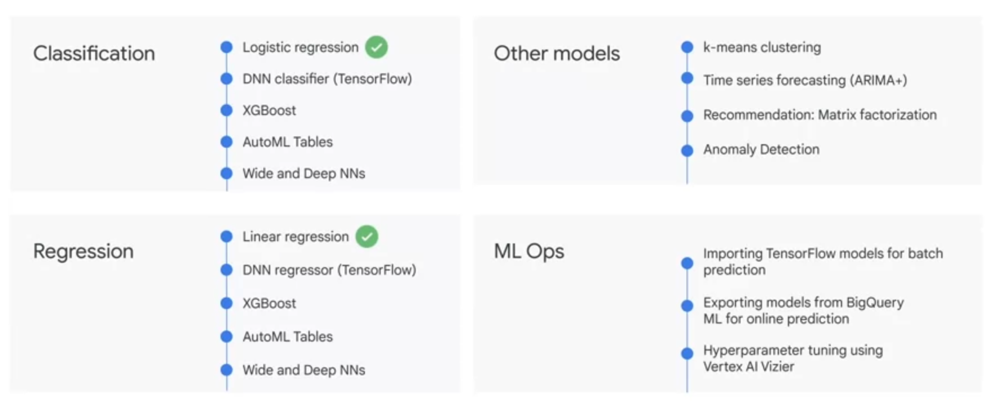

- volume (size)
- variety (format)
- velocity (speed)
- veracity (accuracy)

- real-time data (streaming) requires pub/sub
- batch data uses cloud storage
	- dataflow for ETL
		- bigquery for analytics 
			- bi tools
				- looker 
				- looker studio
				- tableau
				- google sheets
			- ai/ml tools
				- AutoML
				- Vertex AI Workbench


### Data Sources
- internal native
- external (eg: spanner, cloud sql, cloud storage, sheets)
- multi-cloud
- public

### Data Loading Patterns
- batch 
	- one time or scheduled
	- new or append
- streaming 
	- continuous smaller batches for near real time
- generated
	- sql query inserts or query results into

### Analytics Capabilities
- ad hoc
- geospatial 
	- geo data types and functions 
- build machine learning models
	- bigquery ml
- bi dashboards
	- biquery bi engine

> Note: 4 TB queried in 30 seconds across all machines which took a total of 24 hours worth of compute for one machine by cutting and shuffling the filesystem tables by the index

### BigQuery ML
1. create model with SQL statement
```sql
CREATE MODEL numbikes.model
OPTIONS
	(model_type='linear_reg', labels=['num_trips']) AS 
WITH bike_data AS (
SELECT 
	COUNT(*) as num_trips
)
```
2. write a SQL prediction query and invoke ml.PREDICT
```sql
SELECT 
	predicted_num_trips, num_trips, trip_data
FROM
	ml.PREDICT(MODEL `numbikes.model`, (WITH bike_data AS (
	SELECT 
		COUNT(*) as num_trips
	)))
```

#### Models
- supervised 
	- task-driven and identify a goal
		- classify data
			- is an email spam?
				- logistic regression
		- predict a number
			- shoe sales for next 3 months
				- linear regression
- unsupervised
	- data-driven and identify a pattern
		- identify patterns and clusters
			- grouping photos
				- cluster analysis



### ML Dev and Ops
	- dev
		- train model
		- eval result
		- upgrade data
		- engineer feature
	- ops
		- release
		- deploy
		- monitor
- import Tensorflow models
- export models from BigQuery ML
- hyperparameter tuning

### BigQuery ML Project Phases
- ETL
- select and preprocess features 
	- a feature is a column or a computed column
- create model inside BQ
- eval perf of trained model
- use model to make predictions

### BigQuery ML Commands
- create or replace
```sql
CREATE OR REPLACE MODEL `mydataset.mymodel` OPTIONS (model_type='linear_reg') AS 
```
	
- inspect what model learned with weights
	- weight is coefficient applied to each feature in determining outcome of model
```sql
SELECT category, weight
FROM 
	UNNEST((
		SELECT category_weights
		FROM ML.WEIGHTS(MODEL `mydataset.model`)
		WHERE processed_input = 'seed'
	)) 
	
```

- evaluate model perf
	- ML.EVALUATE
```sql
SELECT * FROM ML.EVALUATE(MODEL `mydataset.model`)
```

- make batch predictions
	- ML.PREDICT
	```sql
	CREATE OR REPLACE TABLE `bracketology.predictions` AS (
		SELECT * FROM ML.PREDICT(MODEL `bracketology.ncaa_model`,
	# predicting for 2018 tournament games (2017 season)
	(SELECT * FROM `data-to-insights.ncaa.2018_tournament_results`)
		)
	)
```

### Supervised Models
1. use label column name or specify in input_label_cols options
2. model features are columns in SELECT clause after CREATE MODEL clause
3. SELECT * FROM ML.FEATURE_INFO(MODEL `mydataset.model`) to get stats and metrics of features from trained model
4. Model object will reside in your BigQuery dataset (similar to tables and views) 
5. to create a model, run CREATE MODEL, select type and pass in training dataset
6. SELECT * FROM ML.TRAINING_INFO(MODEL `mydataset.model`) to get training data while it's running
7. SELECT * FROM ML.WEIGHTS inspect weights
8. SELECT * FROM ML.EVALUATE
9. SELECT * FROM ML.PREDICT

### Lab
1. load data using BigQuery
2. query and explore dataset
3. create training and evaluation dataset
4. create classification model
5. evaluate model perf
6. predict and rank purchase probability

```sql
#standardSQL
WITH visitors AS(
SELECT
COUNT(DISTINCT fullVisitorId) AS total_visitors
FROM `data-to-insights.ecommerce.web_analytics`
),

purchasers AS(
SELECT
COUNT(DISTINCT fullVisitorId) AS total_purchasers
FROM `data-to-insights.ecommerce.web_analytics`
WHERE totals.transactions IS NOT NULL
)

SELECT
  total_visitors,
  total_purchasers,
  total_purchasers / total_visitors AS conversion_rate
FROM visitors, purchasers```


```sql
SELECT
  p.v2ProductName,
  p.v2ProductCategory,
  SUM(p.productQuantity) AS units_sold,
  ROUND(SUM(p.localProductRevenue/1000000),2) AS revenue
FROM `data-to-insights.ecommerce.web_analytics`,
UNNEST(hits) AS h,
UNNEST(h.product) AS p
GROUP BY 1, 2
ORDER BY revenue DESC
LIMIT 5;
```

```sql
# visitors who bought on a return visit (could have bought on first as well)
WITH all_visitor_stats AS (
SELECT
  fullvisitorid, # 741,721 unique visitors
  IF(COUNTIF(totals.transactions > 0 AND totals.newVisits IS NULL) > 0, 1, 0) AS will_buy_on_return_visit
  FROM `data-to-insights.ecommerce.web_analytics`
  GROUP BY fullvisitorid
)

SELECT
  COUNT(DISTINCT fullvisitorid) AS total_visitors,
  will_buy_on_return_visit
FROM all_visitor_stats
GROUP BY will_buy_on_return_visit
```

```sql
SELECT
  * EXCEPT(fullVisitorId)
FROM

  # features
  (SELECT
    fullVisitorId,
    IFNULL(totals.bounces, 0) AS bounces,
    IFNULL(totals.timeOnSite, 0) AS time_on_site
  FROM
    `data-to-insights.ecommerce.web_analytics`
  WHERE
    totals.newVisits = 1)
  JOIN
  (SELECT
    fullvisitorid,
    IF(COUNTIF(totals.transactions > 0 AND totals.newVisits IS NULL) > 0, 1, 0) AS will_buy_on_return_visit
  FROM
      `data-to-insights.ecommerce.web_analytics`
  GROUP BY fullvisitorid)
  USING (fullVisitorId)
ORDER BY time_on_site DESC
LIMIT 10;
```

```sql
CREATE OR REPLACE MODEL `ecommerce.classification_model`
OPTIONS
(
model_type='logistic_reg',
labels = ['will_buy_on_return_visit']
)
AS

#standardSQL
SELECT
  * EXCEPT(fullVisitorId)
FROM

  # features
  (SELECT
    fullVisitorId,
    IFNULL(totals.bounces, 0) AS bounces,
    IFNULL(totals.timeOnSite, 0) AS time_on_site
  FROM
    `data-to-insights.ecommerce.web_analytics`
  WHERE
    totals.newVisits = 1
    AND date BETWEEN '20160801' AND '20170430') # train on first 9 months
  JOIN
  (SELECT
    fullvisitorid,
    IF(COUNTIF(totals.transactions > 0 AND totals.newVisits IS NULL) > 0, 1, 0) AS will_buy_on_return_visit
  FROM
      `data-to-insights.ecommerce.web_analytics`
  GROUP BY fullvisitorid)
  USING (fullVisitorId)
;
```

```sql
SELECT
  roc_auc,
  CASE
    WHEN roc_auc > .9 THEN 'good'
    WHEN roc_auc > .8 THEN 'fair'
    WHEN roc_auc > .7 THEN 'not great'
  ELSE 'poor' END AS model_quality
FROM
  ML.EVALUATE(MODEL ecommerce.classification_model,  (

SELECT
  * EXCEPT(fullVisitorId)
FROM

  # features
  (SELECT
    fullVisitorId,
    IFNULL(totals.bounces, 0) AS bounces,
    IFNULL(totals.timeOnSite, 0) AS time_on_site
  FROM
    `data-to-insights.ecommerce.web_analytics`
  WHERE
    totals.newVisits = 1
    AND date BETWEEN '20170501' AND '20170630') # eval on 2 months
  JOIN
  (SELECT
    fullvisitorid,
    IF(COUNTIF(totals.transactions > 0 AND totals.newVisits IS NULL) > 0, 1, 0) AS will_buy_on_return_visit
  FROM
      `data-to-insights.ecommerce.web_analytics`
  GROUP BY fullvisitorid)
  USING (fullVisitorId)

));
```

```sql
CREATE OR REPLACE MODEL `ecommerce.classification_model_2`
OPTIONS
  (model_type='logistic_reg', labels = ['will_buy_on_return_visit']) AS

WITH all_visitor_stats AS (
SELECT
  fullvisitorid,
  IF(COUNTIF(totals.transactions > 0 AND totals.newVisits IS NULL) > 0, 1, 0) AS will_buy_on_return_visit
  FROM `data-to-insights.ecommerce.web_analytics`
  GROUP BY fullvisitorid
)

# add in new features
SELECT * EXCEPT(unique_session_id) FROM (

  SELECT
      CONCAT(fullvisitorid, CAST(visitId AS STRING)) AS unique_session_id,

      # labels
      will_buy_on_return_visit,

      MAX(CAST(h.eCommerceAction.action_type AS INT64)) AS latest_ecommerce_progress,

      # behavior on the site
      IFNULL(totals.bounces, 0) AS bounces,
      IFNULL(totals.timeOnSite, 0) AS time_on_site,
      totals.pageviews,

      # where the visitor came from
      trafficSource.source,
      trafficSource.medium,
      channelGrouping,

      # mobile or desktop
      device.deviceCategory,

      # geographic
      IFNULL(geoNetwork.country, "") AS country

  FROM `data-to-insights.ecommerce.web_analytics`,
     UNNEST(hits) AS h

    JOIN all_visitor_stats USING(fullvisitorid)

  WHERE 1=1
    # only predict for new visits
    AND totals.newVisits = 1
    AND date BETWEEN '20160801' AND '20170430' # train 9 months

  GROUP BY
  unique_session_id,
  will_buy_on_return_visit,
  bounces,
  time_on_site,
  totals.pageviews,
  trafficSource.source,
  trafficSource.medium,
  channelGrouping,
  device.deviceCategory,
  country
);
```

```sql
#standardSQL
SELECT
  roc_auc,
  CASE
    WHEN roc_auc > .9 THEN 'good'
    WHEN roc_auc > .8 THEN 'fair'
    WHEN roc_auc > .7 THEN 'not great'
  ELSE 'poor' END AS model_quality
FROM
  ML.EVALUATE(MODEL ecommerce.classification_model_2,  (

WITH all_visitor_stats AS (
SELECT
  fullvisitorid,
  IF(COUNTIF(totals.transactions > 0 AND totals.newVisits IS NULL) > 0, 1, 0) AS will_buy_on_return_visit
  FROM `data-to-insights.ecommerce.web_analytics`
  GROUP BY fullvisitorid
)

# add in new features
SELECT * EXCEPT(unique_session_id) FROM (

  SELECT
      CONCAT(fullvisitorid, CAST(visitId AS STRING)) AS unique_session_id,

      # labels
      will_buy_on_return_visit,

      MAX(CAST(h.eCommerceAction.action_type AS INT64)) AS latest_ecommerce_progress,

      # behavior on the site
      IFNULL(totals.bounces, 0) AS bounces,
      IFNULL(totals.timeOnSite, 0) AS time_on_site,
      totals.pageviews,

      # where the visitor came from
      trafficSource.source,
      trafficSource.medium,
      channelGrouping,

      # mobile or desktop
      device.deviceCategory,

      # geographic
      IFNULL(geoNetwork.country, "") AS country

  FROM `data-to-insights.ecommerce.web_analytics`,
     UNNEST(hits) AS h

    JOIN all_visitor_stats USING(fullvisitorid)

  WHERE 1=1
    # only predict for new visits
    AND totals.newVisits = 1
    AND date BETWEEN '20170501' AND '20170630' # eval 2 months

  GROUP BY
  unique_session_id,
  will_buy_on_return_visit,
  bounces,
  time_on_site,
  totals.pageviews,
  trafficSource.source,
  trafficSource.medium,
  channelGrouping,
  device.deviceCategory,
  country
)
));
```

```sql
SELECT
*
FROM
  ml.PREDICT(MODEL `ecommerce.classification_model_2`,
   (

WITH all_visitor_stats AS (
SELECT
  fullvisitorid,
  IF(COUNTIF(totals.transactions > 0 AND totals.newVisits IS NULL) > 0, 1, 0) AS will_buy_on_return_visit
  FROM `data-to-insights.ecommerce.web_analytics`
  GROUP BY fullvisitorid
)

  SELECT
      CONCAT(fullvisitorid, '-',CAST(visitId AS STRING)) AS unique_session_id,

      # labels
      will_buy_on_return_visit,

      MAX(CAST(h.eCommerceAction.action_type AS INT64)) AS latest_ecommerce_progress,

      # behavior on the site
      IFNULL(totals.bounces, 0) AS bounces,
      IFNULL(totals.timeOnSite, 0) AS time_on_site,
      totals.pageviews,

      # where the visitor came from
      trafficSource.source,
      trafficSource.medium,
      channelGrouping,

      # mobile or desktop
      device.deviceCategory,

      # geographic
      IFNULL(geoNetwork.country, "") AS country

  FROM `data-to-insights.ecommerce.web_analytics`,
     UNNEST(hits) AS h

    JOIN all_visitor_stats USING(fullvisitorid)

  WHERE
    # only predict for new visits
    totals.newVisits = 1
    AND date BETWEEN '20170701' AND '20170801' # test 1 month

  GROUP BY
  unique_session_id,
  will_buy_on_return_visit,
  bounces,
  time_on_site,
  totals.pageviews,
  trafficSource.source,
  trafficSource.medium,
  channelGrouping,
  device.deviceCategory,
  country
)

)

ORDER BY
  predicted_will_buy_on_return_visit DESC;
```


```sql
CREATE OR REPLACE MODEL `ecommerce.classification_model_3`
        OPTIONS
          (model_type='BOOSTED_TREE_CLASSIFIER' , l2_reg = 0.1, num_parallel_tree = 8, max_tree_depth = 10,
              labels = ['will_buy_on_return_visit']) AS

        WITH all_visitor_stats AS (
        SELECT
          fullvisitorid,
          IF(COUNTIF(totals.transactions > 0 AND totals.newVisits IS NULL) > 0, 1, 0) AS will_buy_on_return_visit
          FROM `data-to-insights.ecommerce.web_analytics`
          GROUP BY fullvisitorid
        )

        # add in new features
        SELECT * EXCEPT(unique_session_id) FROM (

          SELECT
              CONCAT(fullvisitorid, CAST(visitId AS STRING)) AS unique_session_id,

              # labels
              will_buy_on_return_visit,

              MAX(CAST(h.eCommerceAction.action_type AS INT64)) AS latest_ecommerce_progress,

              # behavior on the site
              IFNULL(totals.bounces, 0) AS bounces,
              IFNULL(totals.timeOnSite, 0) AS time_on_site,
              totals.pageviews,

              # where the visitor came from
              trafficSource.source,
              trafficSource.medium,
              channelGrouping,

              # mobile or desktop
              device.deviceCategory,

              # geographic
              IFNULL(geoNetwork.country, "") AS country

          FROM `data-to-insights.ecommerce.web_analytics`,
             UNNEST(hits) AS h

            JOIN all_visitor_stats USING(fullvisitorid)

          WHERE 1=1
            # only predict for new visits
            AND totals.newVisits = 1
            AND date BETWEEN '20160801' AND '20170430' # train 9 months

          GROUP BY
          unique_session_id,
          will_buy_on_return_visit,
          bounces,
          time_on_site,
          totals.pageviews,
          trafficSource.source,
          trafficSource.medium,
          channelGrouping,
          device.deviceCategory,
          country
        );
```


```sql
#standardSQL
SELECT
  roc_auc,
  CASE
    WHEN roc_auc > .9 THEN 'good'
    WHEN roc_auc > .8 THEN 'fair'
    WHEN roc_auc > .7 THEN 'not great'
  ELSE 'poor' END AS model_quality
FROM
  ML.EVALUATE(MODEL ecommerce.classification_model_3,  (

WITH all_visitor_stats AS (
SELECT
  fullvisitorid,
  IF(COUNTIF(totals.transactions > 0 AND totals.newVisits IS NULL) > 0, 1, 0) AS will_buy_on_return_visit
  FROM `data-to-insights.ecommerce.web_analytics`
  GROUP BY fullvisitorid
)

# add in new features
SELECT * EXCEPT(unique_session_id) FROM (

  SELECT
      CONCAT(fullvisitorid, CAST(visitId AS STRING)) AS unique_session_id,

      # labels
      will_buy_on_return_visit,

      MAX(CAST(h.eCommerceAction.action_type AS INT64)) AS latest_ecommerce_progress,

      # behavior on the site
      IFNULL(totals.bounces, 0) AS bounces,
      IFNULL(totals.timeOnSite, 0) AS time_on_site,
      totals.pageviews,

      # where the visitor came from
      trafficSource.source,
      trafficSource.medium,
      channelGrouping,

      # mobile or desktop
      device.deviceCategory,

      # geographic
      IFNULL(geoNetwork.country, "") AS country

  FROM `data-to-insights.ecommerce.web_analytics`,
     UNNEST(hits) AS h

    JOIN all_visitor_stats USING(fullvisitorid)

  WHERE 1=1
    # only predict for new visits
    AND totals.newVisits = 1
    AND date BETWEEN '20170501' AND '20170630' # eval 2 months

  GROUP BY
  unique_session_id,
  will_buy_on_return_visit,
  bounces,
  time_on_site,
  totals.pageviews,
  trafficSource.source,
  trafficSource.medium,
  channelGrouping,
  device.deviceCategory,
  country
)
));
```

```sql
SELECT
*
FROM
  ml.PREDICT(MODEL `ecommerce.classification_model_3`,
   (

WITH all_visitor_stats AS (
SELECT
  fullvisitorid,
  IF(COUNTIF(totals.transactions > 0 AND totals.newVisits IS NULL) > 0, 1, 0) AS will_buy_on_return_visit
  FROM `data-to-insights.ecommerce.web_analytics`
  GROUP BY fullvisitorid
)

  SELECT
      CONCAT(fullvisitorid, '-',CAST(visitId AS STRING)) AS unique_session_id,

      # labels
      will_buy_on_return_visit,

      MAX(CAST(h.eCommerceAction.action_type AS INT64)) AS latest_ecommerce_progress,

      # behavior on the site
      IFNULL(totals.bounces, 0) AS bounces,
      IFNULL(totals.timeOnSite, 0) AS time_on_site,
      totals.pageviews,

      # where the visitor came from
      trafficSource.source,
      trafficSource.medium,
      channelGrouping,

      # mobile or desktop
      device.deviceCategory,

      # geographic
      IFNULL(geoNetwork.country, "") AS country

  FROM `data-to-insights.ecommerce.web_analytics`,
     UNNEST(hits) AS h

    JOIN all_visitor_stats USING(fullvisitorid)

  WHERE
    # only predict for new visits
    totals.newVisits = 1
    AND date BETWEEN '20170701' AND '20170801' # test 1 month

  GROUP BY
  unique_session_id,
  will_buy_on_return_visit,
  bounces,
  time_on_site,
  totals.pageviews,
  trafficSource.source,
  trafficSource.medium,
  channelGrouping,
  device.deviceCategory,
  country
)

)

ORDER BY
  predicted_will_buy_on_return_visit DESC;
```