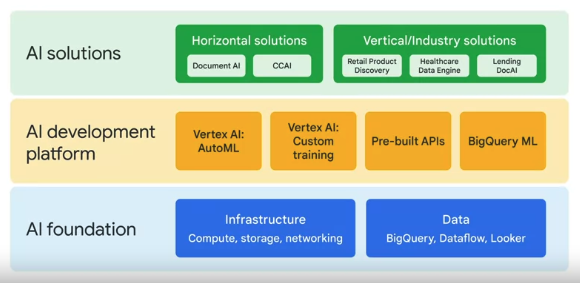

### ML Model Options
- BigQuery ML
	- SQL to create and execute machine learning models in BigQuery
- Pre-built APIs
	- inference on trained models
		- speech to text
			- convert audio to text for data proc
		- cloud natural language api
			- recognizes parts of speech called entities and sentiment
		- cloud translation api
			- convert text from one lang to another
		- text-to-speech
			- convert text into high quality audio
		- vision api
			- works with and recognizes content in static images
		- video intelligence api
			- recognizes motion and action in video
- AutoML
	- no-code solution to build ML models on Vertex AI
		- training models involves: 
			- repeatedly adding new data and features
			- trying different models
			- tuning parameters
		- automl involves 2 things
			1. transfer learning
				- build a knowledge base
				- take advantage of pre-trained models that have been trained on similar larger datasets
				- supplement your model with the pretrained insights
			2. neural architecture search
				- find the optimal model for the relevant project
					- powered by latest ml research
					- trains and evaluates multiple models
					- produces an ensemble of ml models
					- chooses the best one
				- train custom ml models with
					- minimal effort
					- little ml expertise
				- allow data scientist to focus on
					- defining business problems
					- evaluating and improving model results
				
						
- Custom training
	- code your own ML environment to have control over the ML pipeline on Vertex Workbench

### AutoML
- data types (image, video, text, tabular)
	- for each type, AutoML solves different types of problems called objectives
- load data from cloud storage, local machine, or bigquery
- inform AutoML of the problems to solve
- image
	- use a classification model to analyze image data and return a list of content categories that apply to the image
	- use an object detection model to analyze your image data and return annotations that consist of a label and bounding box location for each object found in an image
- tabular
	- use regression model to analyze tabular data and return a numeric value
	- use classification model to analyze tabular data and return a list of categories
	- forecasting model can use multiple rows of time-dependent tabular data from the past to predict a series of numeric values in the future
- text
	- use a classification model to analyze text data and return a list of categories that apply to the text found in the data
	- entity extraction model can be used to inspect text data for known entities referenced in the data and label those entities in the text 
	- sentiment analysis model can be used to inspect text data and identify the prevailing emotional opinion within it
- video
	- use a classification model to analyze video data and return a list of categorized shots and segments
		- eg football or basketball game
	- use an object tracking model to analyze video data and return a list of shots and segments where these objects were detected 
	- an action recognition model can be used to analyze video data and return a list of categorized actions with the moments the actions happened
		- golf swing, soccer goal, touchdown

### Custom Training with Vertex AI Workbench
- use a pre-built or empty container
- prebuilt has programs like Tensorflow, Pytorch, Scikit-learn, XGboost, and Python code runtime
1. upload data
2. create features which are processed data which will be put in the model and share them with others using the feature store
3. training and hyperparameter tuning
	- experiment with different models and adjust hyperparameters
4. deployment and model monitoring
	- users can set up the pipeline to transform the model into production by automatically monitoring and performing continuous improvements
- Vertex AI allows you to build with AutoML or Custom training
- AI Solutions

- neural architecture search builds a new architecture with cells of neural nets to build a model to evaluate the data
- transfer learning is using a pre-existing model to fine tune a new specialized model based on the foundation of the earlier model
- transfer learning is like an npm package like leftpad, whereas neural architecture search is like building a library from scratch

