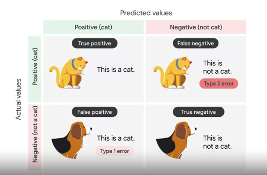
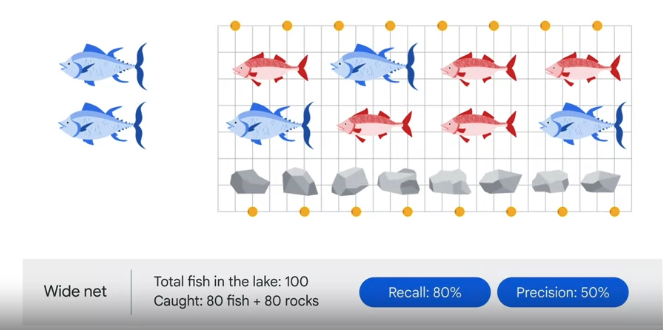
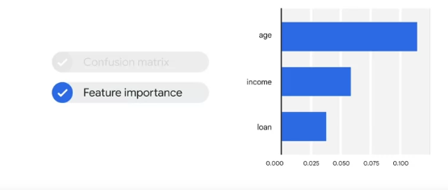
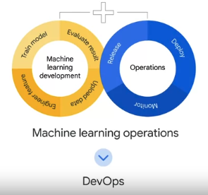

- 3 key stages (iterative)
	- can be automated with MLOps
1. data prep (prepare raw ingredients)
	- stages
		1. data uploading
		2. feature engineering
	- types
		- streaming v batch
		- structured v unstructured 
2. model training (experiment with different recipes)
	- stages (loop)
		1. train
		2. evaluate
3. model serving (serve the meal)
	- deployed
	- monitored
	- managed

Vertex AI supports this workflow with:
- feature store
	- a centralized repository for organizing, storing, and serving features to feed training models
- Vizier
	- help tune hyperparameters in complex machine learning models
- Explainable AI
	- helps interpret training perf and model behavior
- Pipelines
	- automate and monitor the ML production line

### Data Prep
1. upload data
	- provide meaningful name
	- select data type and objective
		- image, tabular, text, video
	- check data requirements
	- add labels to the data
		- a label is a training target
		- manually added
		- added using Google's paid label service via Vertex console
	- upload from BigQuery, Cloud Storage, or local
2. prepare data for model training with feature engineering
	- a feature refers to a factor that contributes to the prediction
		- independent variable
		- column in a table
	- Vertex AI has a Feature Store
		- centralized repository to organize, store and serve machine learning features
		- aggregates features
		- update features 
		- engineers can use the features available in the Feature Store dictionary to build a dataset
		- features are shareable and reusable for training or serving tasks
3. model training
	- iteration (loop)
		- model training 
		- evaluation
	- training
		- supervised
			- provide each data point with a label
			- past data to predict future trends
				- classification
					- predicts a categorical variable
						- cat v dog
				- regression
					- predicts continuous number
						- past sales to predict future
		- unsupervised
			- data-driven and identifies a pattern
			- group customers together
				- clustering
					- groups data points together
						- use customer demographics to determine customer segmentation
				- association
					- identifies underlying relationships
						- correlation between 2 products to place them closer in a grocery store
				- dimensionality reduction
					- reduces number of dimensions
						- combining characteristics to create a quote
	- evaluation
		- evaluation metrics
			- confusion matrix
				- recall
				- precision
			- feature importance
		- confusion matrix is perf measurement for classification problems
		
	- rates model on recall and precision
		
	- recall and precision are a tradeoff
	- Vertex AI visualizes the precision-recall curve
	- feature importance
	
4. model serving
	- ML Ops applied
	
	- solve prod challenges
		- build integrated ML system
		- operate in prod
	- model deployment
		- endpoint or batch (we use endpoint - api)
	- model monitoring
		- Vertex AI Pipelines
			- serverless orchestration
				- automate
				- monitor
				- govern
			- define your own pipeline with prebuilt pipeline components
