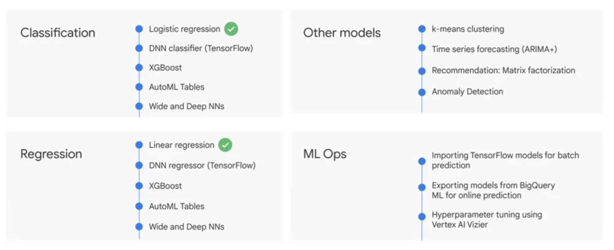

- volume (size)
- variety (format)
- velocity (speed)
- veracity (accuracy)

- real-time data (streaming) requires pub/sub
- batch data uses cloud storage
	- dataflow for ETL
		- bigquery for analytics 
			- bi tools
				- looker 
				- looker studio
				- tableau
				- google sheets
			- ai/ml tools
				- AutoML
				- Vertex AI Workbench


### Data Sources
- internal native
- external (eg: spanner, cloud sql, cloud storage, sheets)
- multi-cloud
- public

### Data Loading Patterns
- batch 
	- one time or scheduled
	- new or append
- streaming 
	- continuous smaller batches for near real time
- generated
	- sql query inserts or query results into

### Analytics Capabilities
- ad hoc
- geospatial 
	- geo data types and functions 
- build machine learning models
	- bigquery ml
- bi dashboards
	- biquery bi engine

> Note: 4 TB queried in 30 seconds across all machines which took a total of 24 hours worth of compute for one machine by cutting and shuffling the filesystem tables by the index

### BigQuery ML
1. create model with SQL statement
```sql
CREATE MODEL numbikes.model
OPTIONS
	(model_type='linear_reg', labels=['num_trips']) AS 
WITH bike_data AS (
SELECT 
	COUNT(*) as num_trips
)
```
2. write a SQL prediction query and invoke ml.PREDICT
```sql
SELECT 
	predicted_num_trips, num_trips, trip_data
FROM
	ml.PREDICT(MODEL `numbikes.model`, (WITH bike_data AS (
	SELECT 
		COUNT(*) as num_trips
	)))
```

#### Models
- supervised 
	- task-driven and identify a goal
		- classify data
			- is an email spam?
				- logistic regression
		- predict a number
			- shoe sales for next 3 months
				- linear regression
- unsupervised
	- data-driven and identify a pattern
		- identify patterns and clusters
			- grouping photos
				- cluster analysis



### ML Dev and Ops
	- dev
		- train model
		- eval result
		- upgrade data
		- engineer feature
	- ops
		- release
		- deploy
		- monitor
- import Tensorflow models
- export models from BigQuery ML
- hyperparameter tuning

### BigQuery ML Project Phases
- ETL
- select and preprocess features 
	- a feature is a column or a computed column
- create model inside BQ
- eval perf of trained model
- use model to make predictions

### BigQuery ML Commands
- create or replace
```sql
CREATE OR REPLACE MODEL `mydataset.mymodel` OPTIONS (model_type='linear_reg') AS 
```
	
- inspect what model learned with weights
	- weight is coefficient applied to each feature in determining outcome of model
```sql
SELECT category, weight
FROM 
	UNNEST((
		SELECT category_weights
		FROM ML.WEIGHTS(MODEL `mydataset.model`)
		WHERE processed_input = 'seed'
	)) 
	
```

- evaluate model perf
	- ML.EVALUATE
```sql
SELECT * FROM ML.EVALUATE(MODEL `mydataset.model`)
```

- make batch predictions
	- ML.PREDICT
	```sql
	CREATE OR REPLACE TABLE `bracketology.predictions` AS (
		SELECT * FROM ML.PREDICT(MODEL `bracketology.ncaa_model`,
	# predicting for 2018 tournament games (2017 season)
	(SELECT * FROM `data-to-insights.ncaa.2018_tournament_results`)
		)
	)
```

### Supervised Models
1. use label column name or specify in input_label_cols options
2. model features are columns in SELECT clause after CREATE MODEL clause
3. SELECT * FROM ML.FEATURE_INFO(MODEL `mydataset.model`) to get stats and metrics of features from trained model
4. Model object will reside in your BigQuery dataset (similar to tables and views) 
5. to create a model, run CREATE MODEL, select type and pass in training dataset
6. SELECT * FROM ML.TRAINING_INFO(MODEL `mydataset.model`) to get training data while it's running
7. SELECT * FROM ML.WEIGHTS inspect weights
8. SELECT * FROM ML.EVALUATE
9. SELECT * FROM ML.PREDICT

