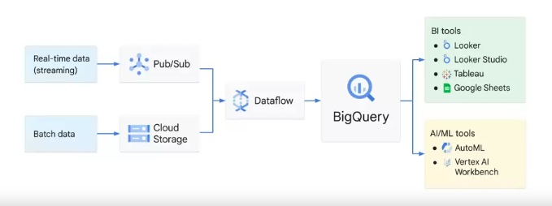

- volume (size)
- variety (format)
- velocity (speed)
- veracity (accuracy)

- real-time data (streaming) requires pub/sub
- batch data uses cloud storage
	- dataflow for ETL
		- bigquery for analytics 
			- bi tools
				- looker 
				- looker studio
				- tableau
				- google sheets
			- ai/ml tools
				- AutoML
				- Vertex AI Workbench

### Data Sources
- internal native
- external (eg: spanner, cloud sql, cloud storage, sheets)
- multi-cloud
- public

### Data Loading Patterns
- batch 
	- one time or scheduled
	- new or append
- streaming 
	- continuous smaller batches for near real time
- generated
	- sql query inserts or query results into

### Analytics Capabilities
- ad hoc
- geospatial 
	- geo data types and functions 
- build machine learning models
	- bigquery ml
- bi dashboards
	- biquery bi engine

