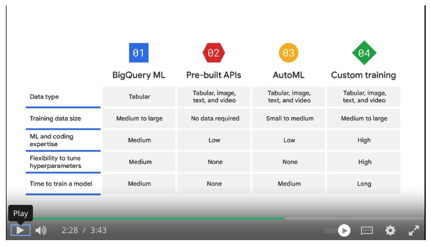

### ML Model Options
- BigQuery ML
	- SQL to create and execute machine learning models in BigQuery
- Pre-built APIs
	- inference on trained models
		- speech to text
			- convert audio to text for data proc
		- cloud natural language api
			- recognizes parts of speech called entities and sentiment
		- cloud translation api
			- convert text from one lang to another
		- text-to-speech
			- convert text into high quality audio
		- vision api
			- works with and recognizes content in static images
		- video intelligence api
			- recognizes motion and action in video
- AutoML
	- no-code solution to build ML models on Vertex AI
- Custom training
	- code your own ML environment to have control over the ML pipeline on Vertex Workbench

